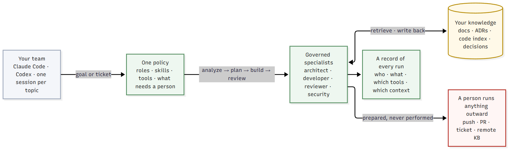

# Skynet Harness

[](https://github.com/i-skynetai/skynet-harness/actions/workflows/tests.yml)
[](https://www.python.org/downloads/)
[](LICENSE)

*One policy for the AI coding agents your team already uses.*

A plugin for Claude Code and Codex. Every session in a managed repository follows one
written policy: specialist agents with fixed tool lists, context from your own documents
and code, decisions remembered, every outward action prepared for a person, and a record
of each run. It supplies no model and replaces no coding agent.



## The problem

Unmanaged coding agents fail in three ways. They invent context instead of looking it
up. They act outside their job: the agent asked to review a patch pushes it. And they
report success that never happened. Each agent product has its own settings for this,
so a team using two keeps two sets of rules that drift apart, and no new session can
find them, so each one starts from zero.

## Words you need

- **Role** — developer, reviewer, architect or security. Each has a fixed tool list,
  derived from the skills it is granted.
- **Policy** — `plugin/policy.yaml`, plus what your organisation and project add under
  it; a lower layer can narrow a role, never widen one.
- **Outward action** — anything that reaches beyond your machine: a push, a pull
  request, a ticket comment, a write to a remote knowledge base. Never plainly allowed.
- **Managed repository** — one holding `.sky/project.yaml`, so the policy applies to
  every session opened in it.

## See it work in sixty seconds

You need Python 3.11 or newer. No install, no account:

```bash
git clone https://github.com/i-skynetai/skynet-harness.git
cd skynet-harness
./sky policy lint
./sky policy developer push
./sky policy reviewer push
./sky policy developer edit
```

This is the real output on a fresh clone:


A push is never a plain allow, for anyone: the agent prepares it and you run it. A
reviewer cannot push at all. An action the policy has never heard of is denied rather
than assumed harmless. `./sky selftest` checks the repository against itself.

## Use it with your team

1. **Install the plugin** from this repository: `/plugin marketplace add
   i-skynetai/skynet-harness`, then `/plugin install sky@sky`. Codex: `./sky host codex`.
2. **Make a repository managed**: `./sky setup init --local` writes `.sky/project.yaml`
   and nothing else; narrow the policy in `.sky/policy.yaml` if you need to.
   `./sky policy show --layers` says where every grant comes from.
3. **Connect context.** `./sky kb init` indexes the repository's own documents into the
   local store; add a knowledge base over MCP, a code index, or both. `./sky doctor`
   shows each capability as `ok`, `MISSING` with the fix, or `absent`.
4. **Work.** `./sky build --task PROJ-123 --role developer --hand claude` starts a
   governed run today. The context loop — `/sky:analyze`, `/sky:decide`, `/sky:plan`,
   `/sky:dispatch` — is the 3.0 roadmap ([SH-083 to SH-091](ROADMAP.md#sh-083)).
5. **Ship it yourself.** `./sky ship` prints every prepared outward action, in order,
   and runs none of them.

The [user guide](docs/user-guide.md) walks through each step with its output.

## What it does

- **One policy across agents.** Roles own skills, skills own tools, and each agent's
  tool list is rendered from the policy. The same rules are read by the launcher, the
  guard hook and the ship command, and a drifted agent definition refuses to launch.
- **Three layers, one ceiling.** An organisation plugin and a project file add skills
  and narrow roles; neither can allow an outward action or re-grant what was removed.
- **Checks readiness first.** `sky doctor` names what is missing before a run starts.
- **Keeps a record the model cannot write.** Identity, events, each tool call and the
  usage the agent reported.
- **The twenty SDLC skills** cover context, design, review, testing, bug fixing and
  more, so a workflow is a repeatable step and not one long prompt.
- **Planned, as rows:** codebase discovery that records what your code already
  decided, decisions kept and found again, evals that measure whether retrieval was
  right and small, per-topic sessions with a built-in bridge
  ([design note](docs/features/3.0-governed-sessions.md)).

## What it is not

- **Not a sandbox.** Claude's agent definition is the tool boundary; the guard hook
  matches command text. Together they stop the ordinary attempt and the honest mistake,
  not a determined one.
- **Not a model or an agent.** It runs the one you have.
- **Not unattended.** Outward actions are printed for a person to run.

## Limits

- The local store is for development and the offline [example](examples/README.md);
  a team knowledge base is yours to connect (see the [knowledge port](docs/knowledge-port.md)).
- Only Claude Code takes a fixed tool list per run. Codex runs the reviewer role only;
  Kimi runs no managed role ([hosts/README.md](hosts/README.md)).
- A narrowed or added role refuses `sky build` until the routing row lands
  ([SH-062](ROADMAP.md#sh-062)).
- Known gaps are rows in [ROADMAP.md](ROADMAP.md).

## Status

**v2.1.2.** The 3.0 rows are in progress; see the [changelog](CHANGELOG.md). **842
tests**, standard library only, on Python 3.11, 3.12 and 3.13 in CI with `sky selftest`.

## Documentation

| | |
|---|---|
| [User guide](docs/user-guide.md) | Install, upgrade, make a repository managed, the first task |
| [Getting started](docs/getting-started.md) | Connect a knowledge base and run your first task |
| [Architecture](docs/architecture.md) | How a task becomes a managed run |
| [Policy](docs/policy.md) | Roles, skills, tools, layers, and why outward actions are special |
| [Context protocol](docs/context-protocol.md) | What any context source must answer |
| [Knowledge port](docs/knowledge-port.md) | Point it at any MCP knowledge base |
| [The local loop](docs/local-workflow.md) | Reviewing, committing, and what leaves the machine |
| [3.0 design](docs/features/3.0-governed-sessions.md) | Governed sessions and the context loop |

## Contributing

Pick a `Ready` row in [ROADMAP.md](ROADMAP.md) and follow
[CONTRIBUTING.md](CONTRIBUTING.md): run the tests, claim the row, open a pull request.

## Licence

Apache 2.0. See [LICENSE](LICENSE).

## Diagram sources

The first picture is [org-value.mmd](docs/images/org-value.mmd), rendered with
`scripts/render-mermaid.py`; the demo picture is a real terminal capture.
