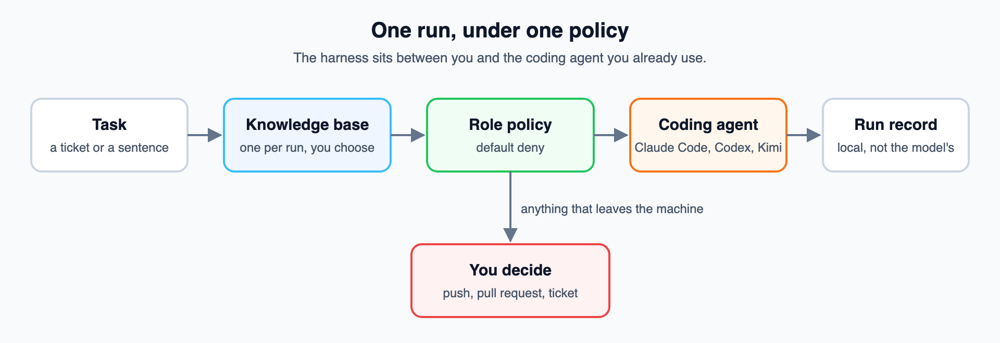
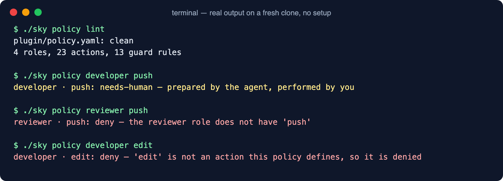
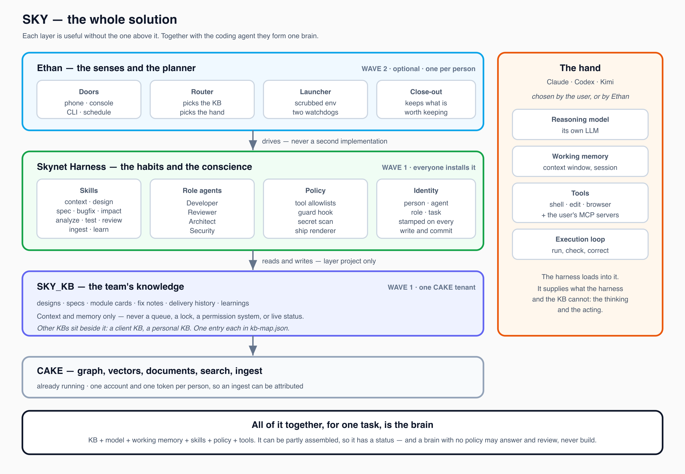

# Skynet Harness

[](https://github.com/i-skynetai/skynet-harness/actions/workflows/tests.yml)
[](https://www.python.org/downloads/)
[](LICENSE)

*One policy for the AI coding agents you already use.*

Skynet Harness runs Claude Code, Codex or Kimi under one written policy. Each run gets
a role with a fixed list of tools, context from one knowledge base you choose, a human
checkpoint on anything that leaves your machine, and a local record of what happened.
It does not supply a model and does not replace your coding agent.



## The problem

Unmanaged coding agents fail in three ways. They invent context instead of looking it
up. They act outside their job: the agent asked to review a patch pushes it. And they
report success that never happened. Each agent product has its own settings for this,
so a team using two of them keeps two sets of rules, and they drift apart.

## Words you need

- **Role** — developer, reviewer, architect or security. Each has a fixed tool list.
- **Policy** — `plugin/policy.yaml`, the one file that says what each role may do.
- **Outward action** — anything that reaches beyond your machine: a push, a pull
  request, a ticket comment. Never plainly allowed.
- **Knowledge base** — a search service the agent reads from, over MCP (the Model
  Context Protocol, the standard way coding agents call outside tools).
- **Managed run** — a session started by `sky build`, so the policy is enforced in it.

## See it work in sixty seconds

You need Python 3.11 or newer. No install, no account:

```bash
git clone https://github.com/i-skynetai/skynet-harness.git
cd skynet-harness
./sky policy lint
./sky policy developer push
./sky policy reviewer push
./sky policy developer edit
```

This is the real output on a fresh clone:



A push is never a plain allow, for anyone: the agent prepares it and you run it. A
reviewer cannot push at all. An action the policy has never heard of is denied rather
than assumed harmless. `./sky selftest` checks the repository against itself.

## Use it with your coding agent

1. **Check what is present.** `./sky doctor` probes the coding agent, the policy, the
   guard and the test runner, and shows a readiness table. With no knowledge base yet,
   the knowledge rows read `MISSING` and say how to fix it.
2. **Connect a knowledge base.** Add it to `~/.config/sky/kb-map.json` and export its
   token. See [getting started](docs/getting-started.md).
3. **Start a managed run.**

   ```bash
   ./sky build --task PROJ-123 --role developer --hand claude
   ```

   The harness checks readiness, applies the role's tool list, blocks the usual git
   credential routes, and launches the agent.
4. **Review the work.** The agent can read, edit, test and commit locally.
5. **Ship it yourself.** The agent leaves its requests in `.sky/outbox/`; when it
   exits, the harness files them. `./sky ship` prints the commands, in order, and
   runs none of them.

## How a run fits together



The coding agent does the thinking and acting. The harness supplies the role, the
skills and the boundary. [Ethan](https://github.com/i-skynetai/ethan), a planner on top,
is a separate and optional repository.

## What it does

- **One policy across agents.** The same roles and default-deny rules, read by the
  launcher, the guard hook and the ship command.
- **Checks readiness first.** `sky doctor` names what is missing instead of starting a
  run that will fail.
- **Blocks the credential paths.** The launcher builds an explicit environment and
  proves git cannot get a credential before the agent starts.
- **Keeps a record the model cannot write.** Each managed run leaves identity, events,
  each tool call and the token usage the agent reported.
- **The twenty SDLC skills** cover context, design, review, testing, bug fixing and
  more, so a workflow is a repeatable step and not one long prompt.

## What it is not

- **Not a sandbox.** The tool list is the real boundary: a role without `Bash` cannot
  run a command. The guard hook is a second layer that matches command text. It stops
  the ordinary attempt and the honest mistake, not a determined one.
- **Not a model or an agent.** It runs the one you have.
- **Not unattended.** Outward actions are printed for a person to run.

## Limits

- No knowledge base ships with the repository, so a full run needs one of your own
  ([SH-020](ROADMAP.md#sh-020)).
- Only Claude Code can run every role, because only it takes a fixed tool list per
  run. Codex runs the reviewer role only; Kimi runs no managed role, since it cannot be
  given a knowledge base for one run ([hosts/README.md](hosts/README.md)).
- Inside a run, the agent could also write straight into `.sky/pending/`, the folder
  `sky ship` reads ([SH-037](ROADMAP.md#sh-037)).
- Planned work and known gaps are rows in [ROADMAP.md](ROADMAP.md).

## Status

**v2.1.2.** See the [changelog](CHANGELOG.md). Not yet tagged as a release. **559 tests**, standard library only, run on Python 3.11, 3.12 and 3.13 in
CI with `sky selftest`.

## Documentation

| | |
|---|---|
| [Getting started](docs/getting-started.md) | Connect a knowledge base and run your first task |
| [Architecture](docs/architecture.md) | How a task becomes a managed run |
| [Policy](docs/policy.md) | Roles, actions, and why outward actions are special |
| [Knowledge port](docs/knowledge-port.md) | Point it at any MCP knowledge base |
| [The local loop](docs/local-workflow.md) | Reviewing, committing, and what leaves the machine |

## Contributing

Pick a `Ready` row in [ROADMAP.md](ROADMAP.md) and follow
[CONTRIBUTING.md](CONTRIBUTING.md): run the tests, claim the row, open a pull request.

## Licence

Apache 2.0. See [LICENSE](LICENSE).
