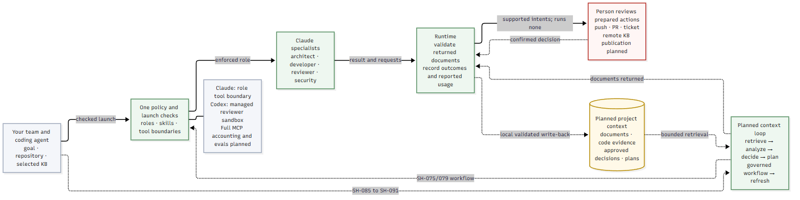

# Skynet Harness

[](https://github.com/i-skynetai/skynet-harness/actions/workflows/tests.yml)
[](https://www.python.org/downloads/)
[](LICENSE)

*Make project knowledge and team rules part of every AI coding task.*

AI can generate code quickly. Your team still has to explain the project, repeat past
decisions, check whether the code follows its rules and review what the agent changed.
When each session starts from scratch, that work keeps coming back.

**Skynet Harness gives your team a shared foundation for AI-assisted development:**
project knowledge it can search, decisions it can reuse, specialist roles with checked
permissions and a record of each managed run. Use it as your team's standard way to
work with AI, so each developer does not have to assemble those pieces alone.


## Why use it?

Store and search project documents, reuse human-approved decisions, and launch
specialists with defined responsibilities. Reviewers can inspect recorded tool calls
and context alongside the agent's report.

Aim for less repeated explanation, fewer corrections and more confident delegation.
Measure results; speed and adoption gains are not yet proven ([adoption guide](docs/adoption.md)).

It installs as a Claude Code or Codex plugin, with a shared Python runtime. Claude specialist
launches have checked tool lists; Codex supports governed implementation and review
for managed local-store projects on the probed host version. People approve
decisions and perform publication. **The full automated workflow is still being built**;
installation does not enforce every action in an ordinary session. See the current status below.

## Words you need

- **Role** — developer, reviewer, architect or security, with checked tools on Claude or individual approvals on supported Codex runs.
- **Policy** — shipped rules plus organisation and project layers under one permission ceiling.
- **Managed repository** — a Git repository with `.sky/project.yaml` and `managed: true`.
- **Outward action** — state-changing publication: push, PR, ticket comment or remote knowledge write.

## See it work in sixty seconds

Git and Python 3.11 or newer; no model account, service or Python dependencies needed:

```sh
git clone https://github.com/i-skynetai/skynet-harness.git
cd skynet-harness
python sky policy lint
python sky policy developer push
python sky policy reviewer push
python sky policy developer edit
```

This is the real output from the policy demo:


A developer prepares publication; a reviewer cannot request a push. Unknown actions
are denied. `python sky selftest` checks the repository against itself. Try the
[local-store example](examples/README.md) next, without a remote knowledge base.

## Use it with your team

1. **Install into Claude Code.** Run these in your shell, from the target repository:

   ```sh
   claude plugin marketplace add i-skynetai/skynet-harness
   claude plugin install sky@sky --scope project
   claude plugin list
   ```

2. **Set up the target Git repository.** Keep the harness checkout for its CLI:

   ```sh
   python <harness-checkout>/sky setup init --local
   python <harness-checkout>/sky policy render
   ```

3. **Connect and index local documents.** No service or key required:

   ```sh
   python <harness-checkout>/sky kb serve --write-adapter
   python <harness-checkout>/sky kb init
   python <harness-checkout>/sky doctor
   ```

4. **Check a launch.** Install the supported host CLI and configure the target's test
   runner first. Dry-run checks readiness without calling the model:

   ```sh
   python <harness-checkout>/sky build --dry-run --role reviewer
   ```

   A real run requires an installed, authenticated supported host. Codex packaging
   and remote-context setup are in the [user guide](docs/user-guide.md).

5. **Review publication yourself.** `python <harness-checkout>/sky ship` prints prepared
   actions and executes none. Each collaborator installs the plugin on their machine;
   automatic team bootstrap remains SH-060.

## What happens on a run



The launcher checks policy, tools and readiness before starting a role. Runtime events
record outcomes and observed MCP context; publication remains a human checkpoint.
Dashed paths are planned. See [architecture](docs/architecture.md).

## What you can use now

- Checked Claude role definitions; Codex developer/reviewer runs use a governed controller.
- Layered policy, rendered tool lists and recorded host tool inventories.
- Local document storage, search, `sky kb init` and an optional code-index adapter.
- Decision proposals and human acceptance, rejection or supersession (SH-087).
- MCP-call ledger and context manifests showing observed calls and returned size.
- The **twenty-four SDLC skills** cover the development workflow.
  Procedure alignment remains SH-082.

## Claude Code and Codex

| Host | Supported today | Setup |
|---|---|---|
| Claude Code | Managed implementation and specialist reviews | Install the `sky` plugin; follow the team setup above |
| Codex | Governed developer/reviewer for managed local projects (0.160.0) | Install `sky@sky` with the native plugin installer |

Install on Codex:

```sh
codex plugin marketplace add i-skynetai/skynet-harness
codex plugin add sky@sky
codex plugin list --marketplace sky
```

Start a new Codex chat and use `$sky:code` or `$sky:review`. The local dispatch tool
launches a governed child; implementation needs a person-admitted plan. Approve the
implementation tool when Codex asks. Parent permissions remain the host's.
See [setup, approval settings and verified limits](hosts/README.md).

## Current status

Skynet Harness is under active development. You can use managed specialist runs,
local document search, approved decision records and run tracking today.

Analysis, planning, offline evals and plan admission are available. Automatic
team setup and the complete session workflow are still being built. People approve decisions and
publishing changes.

**v2.1.2.** This is the manifest version, not yet tagged. Main includes unreleased
3.0 work. See the [roadmap](ROADMAP.md) for planned features and the
[changelog](CHANGELOG.md) for development history. The [user guide](docs/user-guide.md#operating-limits)
explains permission boundaries and current limitations.

## Documentation

| Need | Start here |
|---|---|
| Install, upgrade, first task, troubleshooting | [User guide](docs/user-guide.md) |
| Try local context without an account | [Offline example](examples/README.md) |
| Benefits, team rollout and measurement | [Adoption guide](docs/adoption.md) |
| Concepts and technical reference | [Documentation index](docs/README.md) |
| Known limitations and development history | [Roadmap](ROADMAP.md), [changelog](CHANGELOG.md) |

## Contributing

Report a reproducible bug, propose a feature, improve docs or claim a `Ready` roadmap
row. [CONTRIBUTING.md](CONTRIBUTING.md) explains setup, checks and pull requests.
Use the [issue templates](https://github.com/i-skynetai/skynet-harness/issues/new/choose).

## Licence

Apache 2.0. See [LICENSE](LICENSE).

## Diagram sources

[org-value.mmd](docs/images/org-value.mmd) and [org-loop.mmd](docs/images/org-loop.mmd)
are rendered with `scripts/render-mermaid.py`. The demo picture is real terminal output.
