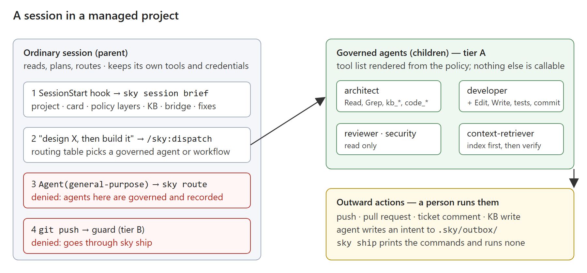
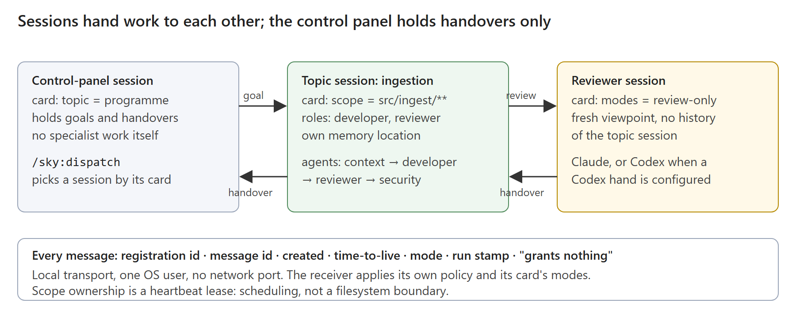

# 3.0 — Governed sessions

**Status:** Proposed; revision 2 after the 2026-10-05 review · **Owner:** @arupmmi07 ·
**Rows:** SH-011 and SH-060 to SH-081 (SH-069 unused) in [ROADMAP.md](../../ROADMAP.md)

One note for one release, because the rows depend on each other and share four
decisions. Each row keeps its own *Done when* in the roadmap; every acceptance line
there is a test. 3.0 ships as **one release**; the order of work inside it is in
[Order of work](#order-of-work).

## Words used here

- **Hand** — the coding agent that does the work: Claude Code, Codex, Kimi.
- **Role** — developer, reviewer, architect, security; each has a fixed tool list.
- **Agent** — a role as the hand sees it: a definition file with a name, a prompt and a
  tool list. Sky's agents live in the plugin; a team's in its own plugin.
- **Tier A** — the agent's tool list. What an agent never receives it cannot call. **Tier
  B** — the guard, which reads each shell command and denies some. A string can be
  rewritten, so tier B stops the ordinary attempt, not a determined one.
- **Action** — a named thing a role may do (`repo.edit`, `push`). **Outward** actions
  reach beyond this machine and are never plainly allowed: the hand prepares them, a
  person runs them.
- **Managed project** — a repository holding `.sky/project.yaml`.
- **Session** — one Claude Code (or Codex) conversation. A **session card** says what a
  session is for: its topic, the paths it owns, its roles, its hand, its owner.
- **Control panel** — a session that holds goals and handovers and sends work to other
  sessions; it does no specialist work itself.
- **Run stamp** — five fields the runtime writes on everything a run produces
  (`sky_agent · sky_run · sky_role · sky_task · sky_kb`). A model never composes it.
- **Adapter** — a mapping from the context protocol's capability names to one server's
  real tool names.
- **Routing** — choosing which agent, workflow or session takes a task.

## What is missing today

Skynet Harness 2.1 governs a run that `sky build` starts: a fresh session, one role, a
fixed tool list, a knowledge base, a record. It does not govern the sessions a team
actually works in.

| Gap | How you know |
|---|---|
| In an ordinary session the plugin's agents are optional; Claude can start its own `general-purpose` agent, and the `context` skill names that as its fallback | `plugin/skills/context/SKILL.md:23`; `plugin/policy.yaml` `guard.scope: harness_runs_only` |
| A role lists tools, not skills; a skill cannot be granted or carry the tools it needs | `plugin/policy.yaml` `roles:` has `tools:` only |
| Each agent's tool list is kept by hand in two places | `plugin/agents/architect.md:4` against `roles.architect.tools` |
| A team cannot add agents, skills or tools without editing the shipped plugin; roles are a closed list of four | `schemas/agent-card.schema.json` `role.enum` |
| Nothing tells a new session what it is | no `SessionStart` hook in `plugin/hooks/hooks.json` |
| Sessions cannot hand work to each other through anything that ships. A transport exists only as a maintainer's local tool, outside any repository | maintainer evidence: `agent-bridge/README.md`, "Installed on this laptop"; not public |
| That transport allows one implementation owner per folder, so two topic sessions in one repository cannot both take work | maintainer evidence: `agent_bridge/store.py` `_check_owner` |
| No agreed handover format between sessions | `schemas/session-summary.schema.json` exists; nothing writes or reads it between sessions |
| Context tools are one vendor's names | SH-024, SH-040, SH-041 |
| The launcher calls `--allowedTools` the boundary; Claude Code's reference says it only pre-approves | `core/sky/launcher.py:348`–`:357`; SH-011 |

## What 3.0 does

A team installs the plugin once. From then on, every Claude Code session opened in one
of their managed projects:

1. learns at start what it is — project, session card, knowledge base, policy layers,
   bridge — and is told the command that fixes anything missing;
2. hands specialist work to governed agents, never to an improvised one; each agent
   holds only the tools of the skills its role grants;
3. gets context through one protocol, index first, code and tickets to verify, with a
   recorded manifest and an enforced budget;
4. can hand a task to another session — Claude to Claude by default, Codex when
   configured — and gets a handover back in one format;
5. can be extended by the team — skills, tool bindings, agents, rules — through a
   proposal that a person activates, never a silent grant.

Nothing in 3.0 adds a tool of its own. A tool is a name the host already has: a
built-in, or a tool from an MCP server the team connected. Sky binds names to actions,
decides who may use which, and records what happened.

## The four decisions

**D1 — The parent session is a dispatcher; enforcement is in the children.** In a
managed project an ordinary session may read, plan and route. Specialist work — writing
code, reviewing, designing, scanning — runs in a governed agent (tier A enforced by the
agent definition) or in a `sky build` session. The parent is held to that by two hooks:
`PreToolUse` on `Agent` (only governed agents may start) and the guard on `Bash`
(outward commands denied). **What D1 does not claim:** the parent's own `Edit`, `Write`
and MCP tools are not restricted, and the parent keeps the person's credentials, which
`sky build` strips. The honest statement is: *in 3.0 the parent is trusted to delegate,
and is stopped from pushing; the child is bounded.* Fail-closed rules: a managed project
whose policy will not load denies every `Agent` start and every guarded command and says
why; the hooks resolve the project from the repository root, so a subdirectory, a
worktree or a `cd` inside the run changes nothing; an `Agent` call with an input the
router does not understand is denied. *Why:* governing only `sky build` leaves the real
work ungoverned; restricting the parent's every tool is a different product.

**D2 — Three policy layers under one ceiling.** Shipped (`plugin/policy.yaml`), org (a
second plugin the team publishes), project (`.sky/policy.yaml`). A later layer may add
skills, tool bindings, agents, workflows and session cards, and may remove a grant. The
ceiling: every tool binding names an **action**; a binding to an unknown action is
denied; a binding to an outward action is prepare-only whatever layer grants it; a lower
layer cannot change an action's classification, its `never`, the guard's scope or
failure mode; a grant an upper layer removed cannot come back through an alias, a new
skill or a new agent. `sky policy lint` reads all three and fails on each of these.
*Why:* "no outward action is ever plainly allowed" holds the design up; a layer that
could break it would make the shipped policy decorative. An existence check on a tool
name proves nothing about permission; the action binding is what does.

**D3 — Roles own skills, skills own tools, agents are rendered.** `roles.<r>.skills` is
the one authoritative list; a skill does not name its roles. An agent's tool list is the
union of its role's `base_tools` and its skills' tools, written by `sky policy render`.
Shipped and org plugins are immutable at runtime. A project narrows or adds by rendering
**project agents** into `.claude/agents/` (host-discovered) and project skills into
`.claude/skills/`, with routing pointing at them; lint rejects a project agent whose name
collides with a plugin agent, and fails when a rendered file differs from the policy.
*Why:* one source for who holds what; the host enforces the rendered list, proven by the
SH-011 probe.

**D4 — The bridge ships with the harness, optional, Claude-to-Claude first.** A
message is a request and grants nothing; the receiver applies its own policy and its
card's mode. Codex is an additional hand, never a requirement. *Why:* most users have
one provider; the per-topic session model must work for them.

## Decisions taken on 2026-10-05

The maintainer resolved the questions the second review left open, so the rows below
are `Ready`. Each *Open* note in the design text records the question; this is the
answer.

| Question | Decision |
|---|---|
| Agent identity and replacement (SH-062) | `sky policy render` writes `.sky/registry.json`: every allowed agent identity with the digest of the policy that produced it. `sky route` allows an identity only if it is in the registry and the digest matches the current render. A role a project narrows is rendered as a project agent named `sky-<role>` in `.claude/agents/`; the shipped `sky:<role>` is then marked *superseded* in the registry and denied. |
| How a tool→action binding is reviewed (SH-064/065) | A binding arrives only through a proposal and `sky policy apply`, so a person sees it. Lint adds a mechanical check: when the MCP server declares tool annotations, a tool without `readOnlyHint: true` cannot be bound to a read action; a tool with `destructiveHint: true` cannot be bound to a non-outward action. Without annotations the binding must carry `reviewed_by`, or lint fails. |
| A running session when policy changes (SH-066) | Each session records the policy digest at start (in the brief). A change takes effect at the next session start. The brief and `sky doctor` say "policy changed since this session started; restart to pick it up". No live revocation in 3.0. |
| Context budget (SH-068/080) | A character cap, advisory in 3.0: over the cap the manifest carries a finding and the brief shows it. The ledger over MCP calls (SH-031) is a hard dependency. Enforcement at the hand-back waits for proof that a `SubagentStop` hook can withhold a result. |
| Bridge identity, modes, leases (SH-070/071/072) | As written in section D: card `modes`; the bridge verifies the live session and the card itself; message id, created, time-to-live, mode, stamp; heartbeat lease; one-OS-user trust limit stated in the docs. |
| Gate result and workflow execution (SH-075/079) | A gate step's result is the agent's final `VERDICT:` line plus findings in the `agent-result` schema. `/sky:dispatch` in the parent runs the steps in order; a step whose capability is absent (no ticket source, no reviewer session) is skipped and said. |
| Handover ingestion (SH-081) | `sky ship` prints `sky ingest <handover-file>`; that command shows the stamped document and asks for confirmation before the single KB call. |
| Per-topic memory (SH-076) | **Still open.** First check whether the host offers a per-session memory-directory setting; if it does, `sky session new` writes it into a launch settings file; if not, the supported answer is one clone per topic and the docs say so. The row stays `Needs decision` until the check is done. |

## Design

### A. The session follows Sky



- `.sky/project.yaml`: declares the project managed; names the org plugin, the KB alias,
  the cards folder, `context.max_tokens`.
- `sky session brief`: the text the hook injects; also a section of `sky doctor`.
  Silent outside a managed project. Names every missing thing and its fixing command.
- `sky route`: the `PreToolUse` decision for `Agent`. Allows only the **exact agent
  identities in the effective-policy registry** that `sky policy render` produced for
  this project, checked against the render digest at the call; a shipped or org agent
  that a project narrowed is *superseded* and denied in favour of its rendered
  replacement, even though its namespace is `sky`. Denies stale, unknown, revoked or
  superseded definitions, malformed input, and everything when the policy will not load;
  allows everything outside a managed project. *Open (SH-062):* the identity and
  replacement rules, agreed before the row is Ready.
- `/sky:dispatch`, **local form** (in 3.0 from the start): reads `routing:` from the
  policy, picks an agent or a workflow in this session, states the choice and why, runs
  it. The **remote form** (a named session over the bridge) is the same skill once cards
  and the bridge exist. The `context` skill's `general-purpose` fallback is removed.
- Guard `scope` gains `managed_projects`.

### B. Roles own skills, skills own tools

```yaml
tools:                                    # name → action; the ceiling applies here
  mcp__tickets__get_issue:   ticket.read
  mcp__tickets__add_comment: ticket.comment      # outward → prepare-only, always
skills:
  release-notes:
    tools: [Read, Grep, mcp__github__list_commits, mcp__tickets__get_issue]
roles:
  developer:
    base_tools: [Read, Edit, Write, Grep, Glob]
    skills: [code, test, bugfix, release-notes]
```

- **Outward tools never reach a child.** A binding to an outward action marks a tool
  *prepare-only*, and prepare-only means the real tool is **excluded from every
  rendered agent**; the agent prepares the action by writing an intent to `.sky/outbox/`
  (the SH-004 route), which the broker renders for a person. A tool bound to a `never`
  action is likewise never rendered, and a grant of a `never` action to any role —
  through `base_tools`, a skill or a new role — is a lint failure. A tool that both
  reads and writes is bound to its write action. How a binding's classification is
  reviewed (so a write tool cannot be labelled `repo.read`) is *open* (SH-064/065).
- `core/sky/policy.py`: `tools:` bindings, `skills:`, `base_tools`, layer merge, the
  ceiling checks, rendering.
- `sky policy render`: writes every plugin agent's `tools:` line and the project agents
  and skills; `sky policy lint` fails on drift, collisions, unknown skills or roles, a
  binding to an unknown action, and any ceiling breach. CI runs both.
- `scripts/check-allowlists.py`: checks skills too; knows each hand's built-in tool
  names; tells "server not reachable now" from "no such tool anywhere".
- `/sky:author`: writes a **proposal**, never a live file. Given "add a release-notes
  skill using GitHub commits and tickets, and let developer use it", it searches the
  catalogue, checks each tool exists and has (or is given) an action binding, writes
  `.sky/proposals/<id>/` holding the skill folder and a policy patch, runs lint against
  the would-be result, and stops. `sky policy apply <id>` — run by a person — moves it
  into the layer and renders. Until then nothing changes: a second session sees the old
  policy and the old tools. An org-layer proposal is a patch against the org plugin's
  source repository, never against an installed copy.
- **Apply is a transaction.** A proposal records the digest of the policy it was made
  against; `apply` re-lints against the current layers, refuses a stale base or a
  conflict with a hand-edited file without overwriting anything, stages the rendered
  files it owns and activates them atomically, and recovers from an interrupted render.
  *Open (SH-066):* whether a session that is already running must restart on a
  revocation, or stays on a recorded policy snapshot until it ends — and how the
  record shows which.

Org skills appear under the org plugin's name (`/acme-sky:release-notes`); rendered
project skills under `.claude/skills/`; both apart from `/sky:*`.

### C. Context through one protocol, within a budget

The Sky Context Protocol (SH-024) names four capabilities — **search**, **graph**,
**code**, **tickets** — and the minimum tool each needs. An adapter (`.sky/context.yaml`)
maps those names to one server's tools. The shipped layer carries adapters for the
knowledge-port names used today and for skygraph (SH-040); a team adds its own.

Order and size are **recorded by the runtime, not asserted by the prompt**: the ledger
(SH-031, a hard dependency, extended to MCP calls in ordinary managed sessions — today
the hook is `Bash`-only and stands aside without `SKY_LAUNCHED`) records each retrieval
call the `context-retriever` agent makes, with the source and the response size; `sky
context manifest` builds the manifest from those events (per-item size and a measured
total — a schema change, since the current one has `budget_tokens` only and
`additionalProperties: false`). The limit is a **character cap** stated as such; an
estimated-token figure may be shown beside it, named as an estimate. Two sizes are kept
apart: what the child retrieved, and the pack it hands back. The hand-back is where a
budget could be enforced, and the host offers a `SubagentStop` hook there; whether that
hook can withhold or replace an oversized result is *open* (SH-080). Until it is shown,
the budget is **advisory**: over the cap the manifest carries a finding, and the docs
say advisory. Verification calls made before any index call are a finding too.

### D. Sessions and the bridge



- **Session card** — `.sky/sessions/<name>.yaml`: name, topic, scope (canonical paths),
  roles, hand, owner, created; schema-checked. `sky session new` writes it; `sky session
  list` reads them. Lint rejects a malformed or duplicate card or an unsupported role or
  hand.
- **Identity contract.** The card gains `modes` (which of `review-only` and
  `implementation` this session may receive). A session registers with the bridge by
  presenting its card and the host's session id; the bridge **verifies for itself** that
  the host id names a live session of this user and that the card file exists under the
  project and matches its schema, then issues a registration record it owns. What the
  bridge derives (registration id, timestamps, the live-session check) is trusted; what
  the sender supplies (text, mode, stamp) is data. A message carries the registration
  id, a message id, `created`, a time-to-live, the mode and the sender's run stamp; the
  envelope says it grants nothing. The receiver refuses: an unknown or unregistered
  sender, an expired or replayed message id, a mode its card does not allow, a card or
  registration that does not match the bridge's record. **Trust limit:** everything runs
  as one operating-system user; the bridge tells sessions apart, it does not defend one
  user from another, and the docs say so.
- **Scope ownership is scheduling, not permission.** One implementation owner per scope
  at a time; scopes compare as canonical paths (case, parent/child, symlinks resolved);
  a claim is atomic; it is a lease the holder renews with a heartbeat, released
  explicitly, and expiring only after missed heartbeats — so a slow but live holder is
  not displaced, and a crashed one is. Two disjoint scopes in one repository both take
  work; overlapping ones do not.
- **Handover** — `/sky:handover` writes a `session-summary` to `.sky/handovers/` — local,
  always possible, KB or not — and, when a KB is configured, drops a `kb.ingest`
  **intent** into `.sky/outbox/` for the broker, so the write is prepared and a person
  runs it, as every outward action is. A bridge reply carries the summary. `sky session
  brief` seeds a new session on the same topic from the latest handover. The summary
  schema gains `topic` and makes `kb` optional; its `role` enum opens to policy roles.
- **`sky bridge`** — the transport, in `core/sky/bridge/`, with tests: registry, Claude
  inbox delivery and the wake hook first (**SH-071**); Codex delivery as a separate row
  (**SH-078**) that is skipped, with a stated reason, when no Codex hand is configured.
  The maintainer's local tool is the prototype; the public code and its tests are the
  evidence.
- **Workflows** — `workflows:` in the policy; each step names who runs it: an agent in
  this session, a named session, or a hand. The shipped `feature` workflow: context →
  duplicate check (tickets, PRs, KB) → architect gate → developer → reviewer agent →
  security agent → reviewer session if one exists → person ships. Validation (every step
  names something that exists; no cycle) is one row; execution (a failed gate stops the
  developer; a missing optional session is skipped and said; `ship` runs nothing) is
  another.
- **Per-topic memory.** The host keeps auto-memory per **repository**: subdirectories
  and worktrees of one git repository share it (`memory#storage-location`), so a topic
  folder inside the repository isolates nothing. The candidate mechanisms are a
  per-session `autoMemoryDirectory` setting passed at launch, or separate clones. The
  card records the resolved memory location, and `sky doctor` compares those locations,
  not working directories. *Open (SH-076):* which mechanism, tested with two topic
  sessions in one repository, resume and a worktree.

### E. The demo knowledge base

SH-020 stands: a standard-library MCP server over public markdown in `examples/`. In 3.0
it also answers the protocol's **search** and **graph** capabilities through an adapter,
so it is the reference adapter and the offline fixture for the context contract tests.
Those tests include the failure paths — a malformed adapter, an unsupported capability,
an unreachable index — not a single happy path.

## A worked example

A team's `payments` repository is managed. A developer opens a session there.

1. The brief appears: `project: payments · card: none (run sky session new) · layers:
   sky, acme-sky · KB: ok · bridge: off`.
2. They type "add a retry to the webhook sender and open a PR".
3. `/sky:dispatch` picks the `feature` workflow and says so. The `context-retriever`
   agent returns a manifest: 3 index hits, 2 code lookups, 4,100 characters, within
   budget. The duplicate check finds an open ticket on the same webhook and says so;
   the developer decides to continue.
4. The architect agent gates the one-paragraph design: `VERDICT: APPROVED`.
5. The developer agent edits and runs tests; the reviewer and security agents each
   return findings; one is fixed.
6. "Open a PR" becomes a `pr.open` intent in `.sky/outbox/`. `sky ship` prints the two
   commands; the person runs them. Until then, no outward state-changing action
   occurred: reads of the KB, tickets and the model's API did happen.

If the developer had asked Claude to use a general agent instead, `sky route` would have
denied it with the reason, and the brief would have pointed at `/sky:dispatch`. The
example is illustrative; the commands and output shapes are proposed, not shipped.

## What it does not do

- No sandbox. Tier A is the agent's tool list; the guard is tier B.
- No restriction of the parent session's own `Edit`, `Write` or MCP tools (D1).
- No tool of its own. Sky never implements search, tickets or git; it binds names.
- No per-agent credential. The stamp says which agent ran; the token says who answers.
- No unattended outward action: push, PR, ticket comment, KB write — a person runs them.
- On Codex, only what Codex offers: the managed reviewer keeps its read-only sandbox
  (`hosts/README.md`); a per-role tool list is not available there.
- Scope ownership is not a filesystem boundary; it stops two sessions scheduling the
  same work, not one session writing where it should not.

## How it is measured

Three kinds of evidence, kept apart: **offline fixture tests** (run in CI, no account),
**authenticated integration checks** (a real hand, run by a maintainer and recorded
with the host version), and **observed live checks** (a person watching).

1. **Team install.** Offline: the settings and `sky setup team` output are tested.
   Integration: a fresh clone of a sample repository, trust granted, session opened:
   the brief appears; `Agent(general-purpose)` is denied with the reason; `/sky:dispatch
   "design X"` runs the architect. Recorded, not claimed as a no-account demo.
2. **Context stays per topic.** Observed: two sessions on one repository, one seeded
   with a topic handover, one long and mixed; the same ticket question in both; record
   the characters in the turn's context, whether the answer is correct, whether it
   names anything from the other topic. Numbers in the release notes.
3. **Handover round-trip.** Integration: control panel → topic session → reviewer
   session → back, Claude to Claude, no Codex configured. Every message carries a
   registration id and a stamp; the control panel's transcript holds the three
   handovers and its own prompts and tool events, and no content copied from the other
   sessions. Then the same with a Codex hand on the review step.

## Order of work

One release. The order is the dependency order; each step's tests pass before the next
starts.

| Step | Rows | Why here |
|---|---|---|
| 0 | SH-011 | prove the boundary the whole design relies on |
| 1 | SH-064, SH-065, SH-067 | policy: bindings, skills, layers, rendering — routing needs resolved agents |
| 2 | SH-070 | cards first, so the brief can name `sky session new` and the router can read a card |
| 3 | SH-060, SH-061, SH-062, SH-063, SH-074 (local, **agent-only**) | the session follows Sky; local dispatch routes to agents only until workflows exist |
| 4 | SH-066 | proposals and `sky policy apply` |
| 5 | SH-072, SH-071, SH-073 | scope ownership before any implementation work crosses the bridge; the Claude transport; local handover |
| 6 | SH-024, SH-040, SH-020, SH-077, SH-031 | protocol, adapters, demo KB, the ledger over MCP calls — workflows and manifests need these |
| 7 | SH-075, SH-079, SH-074 (remote), SH-076, SH-078 | workflow validation, then execution, then dispatch to workflows and sessions; per-topic memory; Codex delivery |
| 8 | SH-068, SH-080, SH-081, SH-041 | manifest, budget, handover ingestion intent, ticket port |

A step may use a **fixture** in place of an optional integration that a later step
supplies (a fake ticket source before SH-041, a fake Codex hand before SH-078), and the
test says so. SH-074 is one row with two acceptance states, local (step 3) and remote
(step 7), each with its own tests and dependencies.

## Facts this design depends on

Checked against the Claude Code documentation on 2026-10-05 (`code.claude.com/docs`),
and where marked, by a probe on Claude Code 2.1.286 (desktop) the same day.

| Fact | Checked | If false |
|---|---|---|
| A plugin hook on `PreToolUse` can match `Agent` and deny it with a reason the model sees | **True** — `hooks-guide` | — |
| The hook input carries `subagent_type` | **True** — `hooks` | — |
| A plugin agent is addressed as `<plugin>:<agent>` | **True** — `plugins/manifest-reference` | — |
| An agent definition's tool list is an availability boundary | **True by the docs** (`sub-agents`) **and by maintainer probes** on Claude Code 2.1.286, 2026-10-05, in-session and in the launcher's headless form (`claude -p --agent ro` with `tools: Read`: the session reported one tool, `Edit` unavailable, file unchanged). Record: [SH-011-probe-2026-10-05.md](SH-011-probe-2026-10-05.md). | D1, D3, and `sky build` alike: the same mechanism carries all of them, so a failure here is a P0 for the current release, not a fallback to `sky build` |
| `--allowedTools` restricts the session's tools | **False by the docs and by probe** — `cli-reference`: it pre-approves; the headless run `claude -p --allowedTools Read` still had `Edit` and used it. The launcher's boundary is the `--agent sky:<role>` definition it also passes (`core/sky/launcher.py:355`), as `hosts/README.md:19` says. SH-011 fixes the comments, the README, and adds the launch refusal on a missing or drifted definition. | — |
| A skill's `allowed-tools` is not a boundary | **True** — `skills` | — (assumed) |
| `SessionStart` stdout reaches the model | **True** — `hooks` | the brief moves to `UserPromptSubmit` |
| `UserPromptSubmit` can add context and block a prompt | **True** — `hooks-guide` | — |
| A plugin can ship `.mcp.json` | **True** — `plugins/components` | org servers connected by team settings instead |
| Project `.claude/settings.json` can enable a marketplace plugin for everyone | **Partly** — `settings`: `extraKnownMarketplaces`, `enabledPlugins`, applied after the folder is trusted | SH-060 ships both the settings and `sky setup team` |
| Project `.claude/agents/` and `.claude/skills/` are host-discovered | **True** — `sub-agents`, `skills` | D3: project agents would need their own plugin |
| Auto-memory is kept per repository, shared by its subdirectories and worktrees | **True** — `memory#storage-location` | SH-076 could use folders after all |
| `SubagentStop` and `Stop` hooks exist | **True** — `hooks` | handover reminders move to the ledger |
| A `SubagentStop` hook can withhold or replace an oversized hand-back | **Unverified** | SH-080 stays advisory |

## Diagram sources

Both figures are hand-written SVG in `docs/images/` (`governed-session.svg`,
`sessions-and-bridge.svg`), rendered to PNG with `plugin/scripts/render-diagram.py`.
Edit the SVG and re-run the script; do not edit the PNG.
