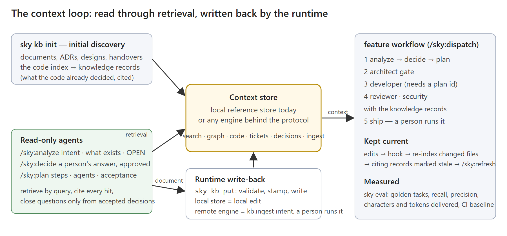

# SH-083 — The context loop and its local store

**Status:** First slice in implementation · **Owner:** @arupmmi07 · **Issue:** roadmap
SH-083–SH-091 · **Date:** 2026-10-06

## What is missing today

The harness can select a KB and launch governed roles, but does not ship the complete
retrieve → analyze → decide → plan → build → refresh loop. The agreed behavior is in
[governed sessions, sections C and F](3.0-governed-sessions.md) and
[ROADMAP.md](../../ROADMAP.md#sh-083). A successful unit test is evidence of a runtime
contract, not proof of the reasoning quality of a live model.



## What done looks like

- An offline repository initializes its documents into a local store and retrieves
  bounded, cited chunks through the same context protocol used for remote sources.
- A refused or interrupted write preserves the previous visible document and manifest;
  competing writers serialize, unsafe paths fail, and readers see one generation.
- Decisions carry runtime confirmation evidence; observations cannot close questions.
  Conflicts, stale evidence and wrong scopes leave a question OPEN.
- An analysis cites retrieved facts or marks them OPEN; a plan pins its input digests.
  Governed implementation cannot start without valid, single-use admission state.
- Retrieval manifests measure calls and characters; stale indexes and budget overruns
  are findings. Golden retrieval tests run offline; live reasoning scores stay separate.

## Design

### Store format and transaction boundary

Each worktree owns `.sky/kb/`. `manifest.json` has `schema_version: 1`, an integer
generation, and a document map: id, type, title, source, revision digest, revision path,
updated timestamp, schema version and chunks (id, character offset, character count).
Later slices add source removal/staleness and index coverage without silently migrating
an unknown version. Unsupported versions fail with a repair/migration instruction.

Documents are UTF-8 Markdown with delimited frontmatter. Generated frontmatter is JSON,
which is also valid YAML; imports accept JSON or the existing strict YAML subset.
Common metadata includes `id`, `type`, `title`, `project`, `relates_to`, `citations`,
`schema_version` and the five `sky_*` stamp fields. Decision and knowledge types also
pass their published, closed schemas. Knowledge confidence is a number from 0 to 1,
an assertion, not a measured accuracy score.

A supplied id is retained. Otherwise the id is a 24-hex SHA-256 prefix over project
and canonical source path, or type/title when there is no source. Body changes keep
that identity; a renamed source must preserve its explicit id to preserve identity.
Chunk ids are `<document-id>#<ordinal>`; default chunks are 2,000 Python Unicode
characters, without overlap. Chunk boundaries are recorded per revision. They are
positional identifiers, not claims that unchanged text retains its chunk after an
insertion. Retrieval hits include both the document id and chunk id.

Revision files are immutable: `.sky/kb/documents/<id>/<sha256>.md`. A writer acquires
`.lock` with an OS advisory lock (Windows byte lock; POSIX flock), re-reads the
manifest, writes and fsyncs a new revision, then atomically replaces the manifest
using a temporary file in the same directory. That manifest replacement is the
commit point. There is no unsafe two-file overwrite. A failure before it leaves the
old manifest and old revision intact, although an unreferenced revision can remain.
Readers capture one manifest and read only its referenced revisions, checking hashes.
The OS releases locks on process exit; a timeout reports contention, never deletes a
possibly live writer's lock. This guarantees process-interruption consistency on the
local filesystem; power-loss durability and network-filesystem locking are not claimed.

`sky kb put <file>` will be thin CLI wiring over `Store.put_file`: require contained
repository-relative paths; reject symlinks at every component; parse metadata; validate
schema, stamp, citation targets and line ranges; apply the existing redaction gate;
commit under the lock. Runtime identity is supplied separately and must match any
stamp carried by the document. Model-written `approval`, `decided_by`, `recorded_at`
or `run_identity` is refused. Local persistence is `repo.edit` performed by the
runtime, with run recording added at the CLI boundary; it does not grant edit tools
to analysis/discovery agents. Remote persistence remains a `kb.ingest` intent (SH-081).

### Protocol server and adapter

`kbserve.serve(store, stdin, stdout)` uses newline-delimited JSON-RPC over stdio:
initialize, initialized notification, ping, tools/list and tools/call. Stdout contains
only protocol frames. Malformed requests, oversized frames, unknown methods and tool
validation errors have explicit responses; notifications receive none. It advertises
five tools with input schemas and read/write annotations. Missing capabilities are
absent: no vector similarity, general graph query, ticket port or code engine is invented.

The next CLI slice exposes `sky kb serve` and installs this adapter entry:

```yaml
servers:
  sky_kb:
    command: python
    args: ["-m", sky, kb, serve]
sources:
  local:
    server: sky_kb
    search.keyword:
      tool: search
    graph.neighbours:
      tool: neighbours
    decisions.find:
      tool: decisions_find
    decisions.record:
      tool: decisions_record
    ingest.document:
      tool: ingest
```

The generated command uses the installed interpreter and explicit project root, not
an assumed working directory. Search scores distinct query tokens overlapping title
and chunk, orders by score descending then document/chunk id, and returns bounded
excerpts, citations, source and tenant. Graph walks directed `relates_to` edges with
a depth cap and visited set; dangling edges are findings. Read-role policies expose
read tools only. A server without a trusted runtime stamp refuses writes; decision
recording also needs an out-of-band runtime confirmation callback. Tool arguments
cannot supply that callback or approval evidence.

### Documents, discovery and applicable decisions

`decision.schema.json` includes id/version, project/scope, question/curated aliases,
answer/rationale, accepted or superseded status, supersedes ids, source analysis and
evidence revision. Runtime-owned fields include recorded time, run identity, actor
and confirmation evidence (actor, session, event id, confirmed time). A stamp alone
does not approve anything. `knowledge.schema.json` records module/category, confidence,
checkout/index digests, citations and stale status. These are observations even when
they describe a choice already encoded in code. Analysis and plan templates describe
OPEN questions, cited claims, step owners/acceptance and pinned input digests; dedicated
runtime validation for their workflow fields lands with SH-085/086.

`sky kb init` (SH-084) enumerates README, documentation/ADRs/designs, local handovers,
and explicitly added paths. Canonical path deduplication precedes reading. Exclude the
store itself, run records, VCS metadata, secret/env-style files and configured exclusions;
list binary/over-cap skips. A source without frontmatter is initially indexed by title
only and listed as such; malformed relations produce findings. Initial imports use
`sky_agent: runtime` and an actual runtime run. Unchanged source digests do nothing;
removed sources are marked stale, not erased. Code-port connectivity and covered or
uncovered modules are recorded explicitly; absence of an index never means full coverage.

`--discover` (SH-088) visits only modules the code port reports. A retriever fetches
bounded symbols, dependencies and call sites; an architect returns cited observations.
Split or mark partial over-budget modules; list uncovered modules. Persist only validated
knowledge records and update only changed module/index digests. Neither agent reads
whole folders or writes the store directly.

`decisions.find` ranks overlap with the question or an explicitly curated alias; it
does not infer semantic aliases. Scope uses repository-relative ancestor paths.
Candidates expose applicability: accepted, not superseded, same project, applicable
scope, approval present and evidence revision matching the supplied current revision.
Without a verified revision they remain candidates. Recency never breaks conflicts.
Analysis closes a question only with a unique applicable answer and cites the id;
equally ranked contradictory hits remain OPEN. A paraphrase with no token overlap
remains OPEN unless a curated alias matches.

### Recorded context, refresh, evaluation and admission

SH-031 extends ledger coverage from Bash to MCP calls in managed sessions using the
shared project resolver, not only `SKY_LAUNCHED`. Record tool/source, input identity,
result references, response character count, failure and sequence; sanitize recorded
inputs. SH-068 builds the context manifest from those events, never model assertions.
Count Unicode characters in returned text and separately in the final hand-back;
name the counting method and any estimated-token conversion. A verification before
any index lookup, unavailable source or advisory cap overrun is a finding. SH-080 must
probe whether a stop hook can enforce a hand-back cap before claiming enforcement.

SH-089 adds separate Edit, Write and NotebookEdit PostToolUse matchers beside Bash
guard/ledger hooks. Atomically append deduplicated contained paths to pending-reindex
under a lock. Stop/refresh snapshots them, calls the code port, and removes only the
successfully processed snapshot, preserving concurrent edits and failed work. Local
index refresh is automatic; remote refresh is an intent. Before retrieval, compare
source/checkout/index digests and mark cited knowledge stale, catching Bash edits,
children, interruptions and other sessions. Stop is a convenience, not the guarantee.

SH-090 golden YAML names task/query, k, expected unique record ids and code locations,
character bound and analysis/plan rubric. Recall = relevant retrieved / expected;
precision = relevant retrieved / retrieved. Count chunks of one record once. Zero
hits yields recall 0 and undefined precision. Missing expected ids and empty stores
fail. Report measured characters and separately estimated tokens. Baseline changes
are reviewed; CI fails regression beyond a stated tolerance. `--live` requires a hand,
records its reported usage and labels rubric results as live evaluations. Start with
five tasks drawn from this repository's public documents.

SH-091 admission state pins canonical project/worktree, analysis/plan/decision digests,
workflow step, one allowed agent identity, policy digest and a single-use expiring token
under `.sky/runs/<id>/current.json`. Routing, launcher and bridge receiver validate and
atomically reserve it. Advance only on validated completion. Refuse missing/stale inputs,
OPEN questions, wrong identity/worktree, expired/replayed token or concurrent reuse.
Analysis, decision, planning and runtime write-back are not gated; the parent session's
own editing is outside this guarantee. `/sky:spec` retains its architect gate and delegates
analyze → decide when needed → plan → dispatch. SH-082 moves triggers, grants and templates
together; reviewer/security steps receive touched modules' knowledge records.

### Implementation slices and tests

| Slice | Rows and boundary | Tests required before proceeding |
|---|---|---|
| 1, now | SH-083 new store/server, decision/knowledge schemas, three templates | round-trip, stable ids/chunks, schema/stamp/citations, symlinks/traversal, contention, interrupted manifest commit, MCP framing/search/graph/decision candidates |
| 2 | SH-024/083 CLI, adapter, doctor/dry-run; no automatic remote writes | fake stdio handshake, absent capabilities, invalid adapter, local offline reviewer readiness, put refusal/run attribution |
| 3 | SH-040 then SH-031/068 | fixture code port; managed MCP ledger counts, failure events, order findings, schema synchronization, measured manifest totals |
| 4 | SH-084, SH-020/077 | exclusions, containment, canonical dedupe, title-only imports, unchanged/removed sources, coverage, offline demo init |
| 5 | SH-087 | runtime-confirmed decision round-trip, forged approval refusal, applicability, aliases, conflict/supersession and project isolation |
| 6 | SH-088/089 | bounded fake module discovery, no citations, partial/uncovered, digest delta, atomic pending queue, failed refresh/concurrent edits, stale reconciliation |
| 7 | SH-085/086 plus SH-082 alignment | fake-hand analyze/plan/write-back; cited or OPEN claims, decision resolution, first decide step, input digest drift and unknown owner |
| 8 | SH-075/079/074 remote then SH-091 | workflow graph validation/failing gates; admission forgery, replay, expiry, concurrent token reservation, wrong scope/session and stale policy/inputs |
| 9 | SH-080/090 then SH-081/041 | budget host probe separately; golden metrics/empty corpus/baselines/live missing hand; remote intent refusal/approval without unintended local deletion |

Slices follow governed-session steps 6–9; cards/routing/bridge dependencies from earlier
steps remain prerequisites for admission. Fixtures replace optional future integrations
only when explicitly named. Each slice runs unit suite, runtime vendor synchronization,
selftest and documentation checks; live host/provider evidence is recorded separately.

### Decisions taken on 2026-10-06

- **SH-087 confirmation transport.** Use a runtime-recorded interactive
  confirmation tied to exact record digest, host session and event id; never trust a
  model's approval-shaped text. Slice 1 only accepts a runtime `Approval` object.
- **Evidence currency.** Require explicit current evidence revision first; a mismatch
  states staleness and prevents applicability. Do not use newest-date wins.
- **SH-090 tolerance/rubric ownership.** Allow zero offline regression and no
  character-bound increase without a reviewed baseline update. The maintainer records
  and reviews live rubric scores; those scores never gate CI.
- **SH-081 execution contract.** `sky ship` prints a `sky ingest <file>` step with
  runtime confirmation against the sealed payload digest. Publication cannot execute from
  an agent tool. The local handover survives a refused remote publication.
- **Store maintenance.** Retain unreferenced revisions until explicit `sky kb gc`
  under the store lock; never collect implicitly, during retrieval or a failed write.

## What it does not do

Slice 1 is importable runtime code, not a shipped `sky kb` CLI command. It does not
initialize sources, add policy grants, register adapters, refresh an index, dispatch
workflows or enforce a budget. Those are tested slices above, not stubs in this slice.
The local store is not a vector database, credential boundary or proof of a model's
judgment. Remote writes, approval UX and admission enforcement remain their own rows.

## How it is measured

Use temporary repositories, fixture documents, fake hands and in-memory stdio frames.
Inject failure before manifest activation and contend real locks; compare visible
manifest/revision bytes before and after. No private service or account is needed.
Record actual suite counts after validation; no throughput or reasoning-quality numbers
are claimed here. Run live protocol/host checks only as separately attributed evidence.

## Diagram sources

[context-loop-detail.mmd](../images/context-loop-detail.mmd) is the Mermaid source for the next
render of the PNG above, which the maintainer supplies. The currently embedded PNG
is the earlier design illustration; [context-loop.svg](../images/context-loop.svg)
is its retained source. No PNG or SVG is edited by this slice.
